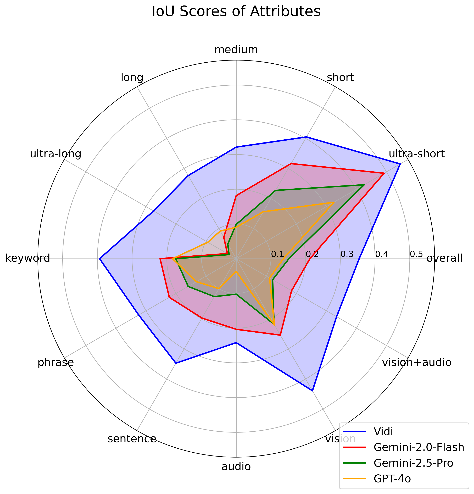
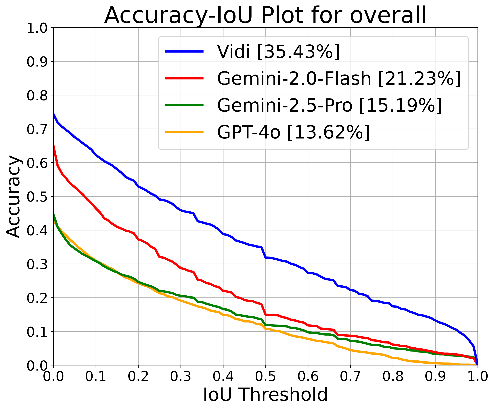

# [Vidi: Large Multimodal Models for Video Understanding and Editing](https://bytedance.github.io/vidi-website/)

Homepage: https://bytedance.github.io/vidi-website/

> We introduce Vidi, a family of Large Multimodal Models (LMMs) for a wide range of video understanding and editing (VUE) scenarios. The first release focuses on temporal retrieval (TR), i.e., identifying the time ranges in input videos corresponding to a given text query. 

## Release
- [04/21/2025] 🔥 The first release of Vidi consists of tech report and the VUE-TR evaluation benchmark. The 7B model demo and weights are coming soon. 

## Content
- [Installation](#installation)
- [Evaluation](#evaluation)
- [ ] Demo
- [ ] Vidi-7B Wight

## Installation
Run the [install.sh](install.sh).

## Evaluation

We release the ground-truth annotation and evaluation results in 5 json files. Run the script for a standalone evaluation:

```
python3 -u qa_eval.py --pred_path results_Vidi.json
```
The result figures will be saved in the output folder ('./results' by default)
. See example figures below:

  

For evaluation of new models, first download the videos based on the video_id from Youtube. Then run inference and save the results in the following format:
```
[
    {
        "query_id": 0,
        "video_id": "coPfnSFOXj0",
        "duration": 32.625,
        "query": "transition from storyboards to animation",
        "answer": [
            [
                0.0,
                32.29875
            ]
        ],
        "task": "temporal_retrieval"
    },
    ...
]
```

<!-- ## Model Release
We release the 7B model weight for reproduction of results. For a given video and text query, run the following command to get the results:

```
python3 -u inference.py --video-path [video path] --query [query] --model-path [model path]
```  -->
