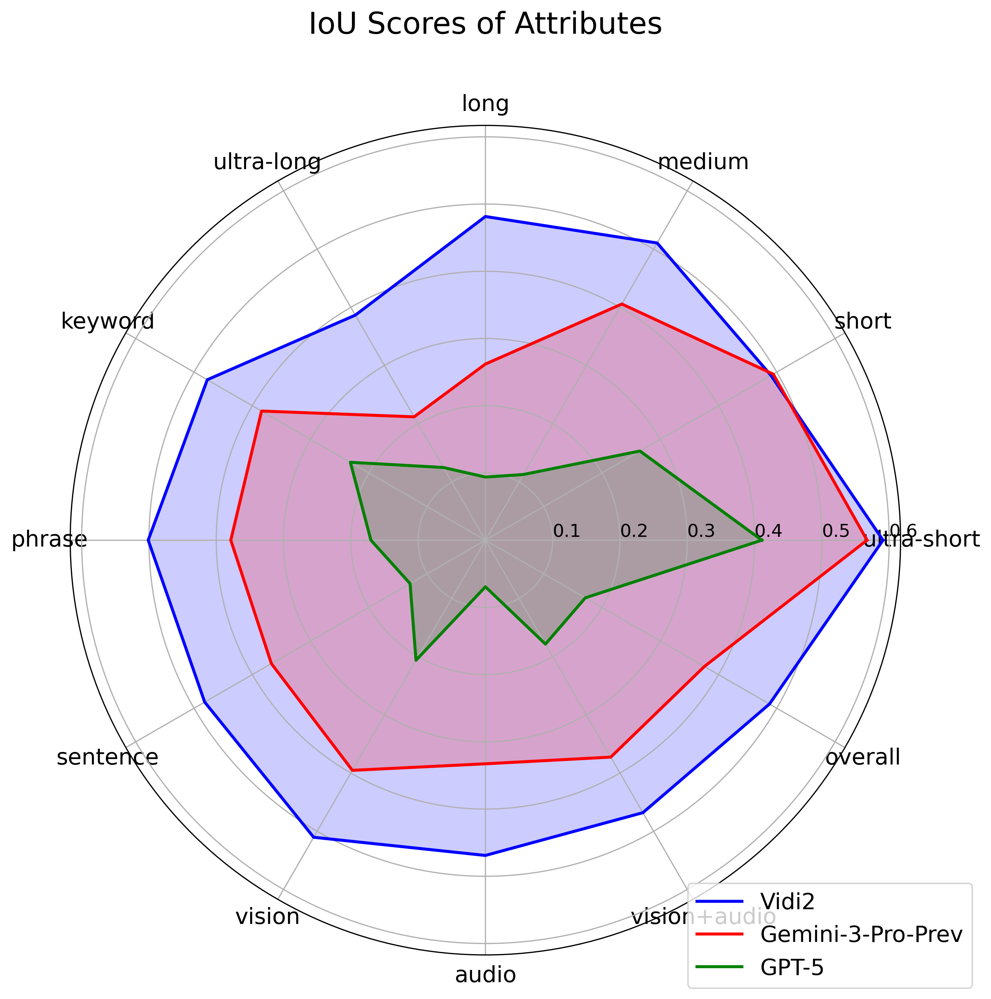
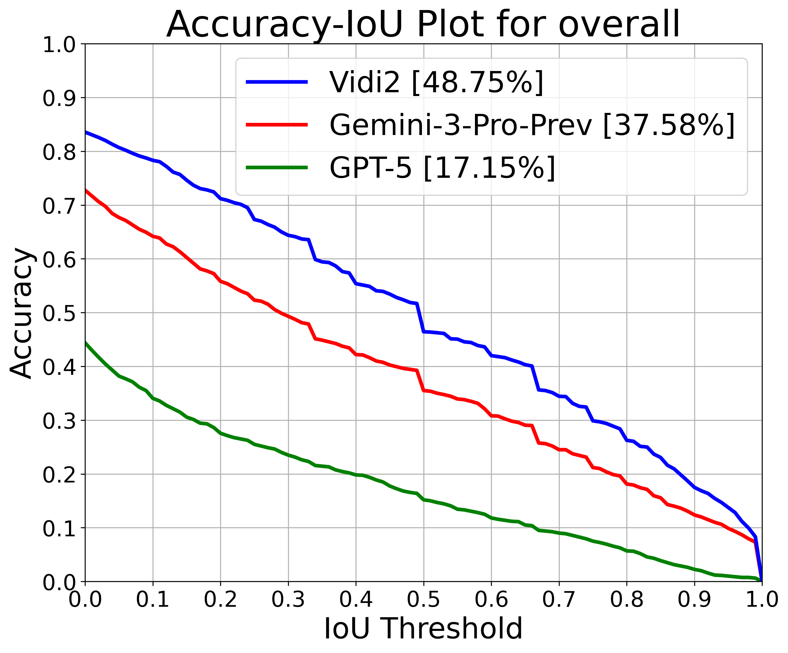

# [Vidi2.5: Large Multimodal Models for Video Understanding and Creation](https://arxiv.org/pdf/2511.19529)

Homepage: https://bytedance.github.io/vidi-website/

> We introduce Vidi, a family of Large Multimodal Models (LMMs) for a wide range of video understanding and editing (VUE) scenarios. The first release focuses on temporal retrieval (TR), i.e., identifying the time ranges in input videos corresponding to a given text query. The second release evolves toward a foundation model with state-of-the-art spatio-temporal grounding (STG) and temporal retrieval capability while maintaining basic open-ended video QA performance. 

## Release
- [01/20/2026] 🔥 Vidi2.5 released with updated report, github, and demo. VUE_PLOT benchmark and Vidi1.5-9B weight with finetune code are included.
- [11/25/2025] 🔥 Vidi2 released at [Report](https://arxiv.org/pdf/2511.19529), [Github](https://github.com/bytedance/vidi), [Homepage](https://bytedance.github.io/vidi-website/), [Demo](https://vidi.byteintl.com/).
- [08/29/2025] 🔥 Vidi1.5-9B demo released at https://vidi.byteintl.com/ with new UI design.
- [06/06/2025] 🔥 Vidi-7B demo released at https://vidi.byteintl.com/. Follow the instructions in the [demo](#demo) section to run the demo.
- [04/21/2025] 🔥 The first release of Vidi consists of tech report and the VUE-TR evaluation benchmark. The 7B model demo and weights are coming soon. 

## Content
- [Demo](https://vidi.byteintl.com/)
- [Evaluation (VUE-PLOT)](#evaluation-vue-plot)
- [Evaluation (VUE-STG)](#evaluation-vue-stg)
- [Evaluation (VUE-TR-V2)](#evaluation-vue-tr-v2)
- [Model Inference and Finetune](#model-inference-and-finetune)


## Demo
Will be updated very soon at [https://vidi.byteintl.com/](https://vidi.byteintl.com/).
<!-- Grounding, Retrieval, Character, Chapter, Highlight, VQA, Thinking -->
1. Select a mode from ["Retrieval", "Grounding", "Highlight", "VQA"] on the segmented button. Please use English query for the best experience.

- "Grounding": Input a text query indicating the object to be searched. The model will find the clips corresponding to text query with bounding boxes on the object.

- "Retrieval": Input a text query to be searched. The model will find the clips corresponding to text query.

- "Highlight": No input query needed. Directly output a set of highlight clips with title.

- "VQA": Input a question/instruction about the video. The model will answer the question.


2. Click "Upload" button and select a video local file (mp4 format). Make sure the video is not corrupted, and the resolution is not too high. 480p is recommended for fast uploading and decoding.
2. After the video is uploaded, wait till the uploading is finished and the video is ready to play in the box.
3. Enter the text query if needed. Click the "Send" button.
4. Wait till the result clips show in the chat box. This could take several minutes for long video.


## Evaluation (VUE-PLOT)
We release the VUE-PLOT benchmark for plot understanding with two tracks, including charater and reasoning. Follow the instruction in [VUE_PLOT/readme.md](VUE_PLOT/readme.md) to conduct evaluation.
To evaluate your own model:
1. You can obtain the raw videos either using the YouTube video IDs or, alternatively, by downloading them from the [Condensed Movies dataset](https://www.robots.ox.ac.uk/~vgg/data/condensed-movies/) homepage.
2. Generate the results of your own model and follow the instruction in [VUE_PLOT/readme.md](VUE_PLOT/readme.md) to finish the evaluation.


## Evaluation (VUE-STG)

We release the video ids, ground-truth annotation and evaluation results in csv files. Follow the instruction in [VUE_STG/README.md](VUE_STG/README.md) to conduct evaluation.
```
cd VUE_STG
python3 evaluate.py
```

To evaluate your own model:
1. First download the videos based on the ids in ["VUE_STG/vue-stg-benchmark/video.csv"](VUE_STG/vue-stg-benchmark/video.csv) from Youtube (e.g., [yt-dlp
](https://github.com/yt-dlp/yt-dlp)). 
2. Generate the result following the format in [VUE_STG/results/vidi2/tubes.csv](VUE_STG/results/vidi2/tubes.csv). Run evaluation script.


## Evaluation (VUE-TR-V2)
We release the ground-truth annotation and evaluation results in 5 json files. Run the script for a standalone evaluation:
```
cd VUE_TR_V2
bash install.sh
python3 -u qa_eval.py --pred_path results_Vidi.json
```
The result figures will be saved in the output folder ('./results' by default)
.

  

For evaluation of new models, first download the videos based on the ids in [VUE_TR_V2/video_id.txt](VUE_TR_V2/video_id.txt) from Youtube (e.g., [yt-dlp
](https://github.com/yt-dlp/yt-dlp)). Then run inference and save the results in the following format:
```
[
    {
        "query_id": 0,
        "video_id": "6Qv-LrXJjSM",
        "duration": 3884.049,
        "query": "The slide showcases Taco Bell's purple ang pow for Chinese New Year, while a woman explains that purple symbolizes royalty in the Chinese tradition.",
        "answer": [
            [
                913.1399199,
                953.5340295
            ]
        ],
        "task": "temporal_retrieval"
    },
    ...
]
```

You may find the instruction and data for the previous version (VUE-TR) [here](VUE_TR/README.md).


## Model Inference and Finetune

- To conduct inference and finetuning for [Vidi1.5-9B](https://huggingface.co/bytedance-research/Vidi1.5-9B), follow the instructions in [Vidi1.5_9B/README.md](Vidi_7B/README.md). 

- To conduct inference for [Vidi-7B](https://huggingface.co/bytedance-research/Vidi-7B), follow the instructions in [Vidi_7B/README.md](Vidi_7B/README.md).


## Citation
If you find Vidi useful for your research and applications, please cite using this BibTeX:
```
@article{Vidi2025vidi2.5,
          title={Vidi2.5: Large Multimodal Models for Video 
                  Understanding and Creation},
          author={Vidi Team, Chia-Wen Kuo, Chuang Huang, Dawei Du, 
                  Fan Chen, Fanding Lei, Feng Gao, Guang Chen, 
                  Haoji Zhang, Haojun Zhao, Jin Liu, Jingjing Zhuge,
                  Lili Fang, Lingxi Zhang, Longyin Wen, Lu Guo,
                  Lu Xu, Lusha Li, Qihang Fan, Rachel Deng, 
                  Shaobo Fang, Shu Zhang, Sijie Zhu, Stuart Siew, 
                  Weiyan Tao, Wen Zhong, Xiaohui Shen, Xin Gu, 
                  Ye Yuan, Yicheng He, Yiming Cui, Zhenfang Chen,
                  Zhihua Wu, Zuhua Lin},
          journal={arXiv preprint arXiv:2511.19529},
          year={2026}
}
@article{Vidi2025vidi,
    title={Vidi: Large Multimodal Models for Video 
            Understanding and Editing},
    author={Vidi Team, Celong Liu, Chia-Wen Kuo, Dawei Du, 
            Fan Chen, Guang Chen, Jiamin Yuan, Lingxi Zhang,
            Lu Guo, Lusha Li, Longyin Wen, Qingyu Chen, 
            Rachel Deng, Sijie Zhu, Stuart Siew, Tong Jin, 
            Wei Lu, Wen Zhong, Xiaohui Shen, Xin Gu, Xing Mei, 
            Xueqiong Qu, Zhenfang Chen},
    journal={arXiv preprint arXiv:2504.15681},
    year={2025}
}
```
