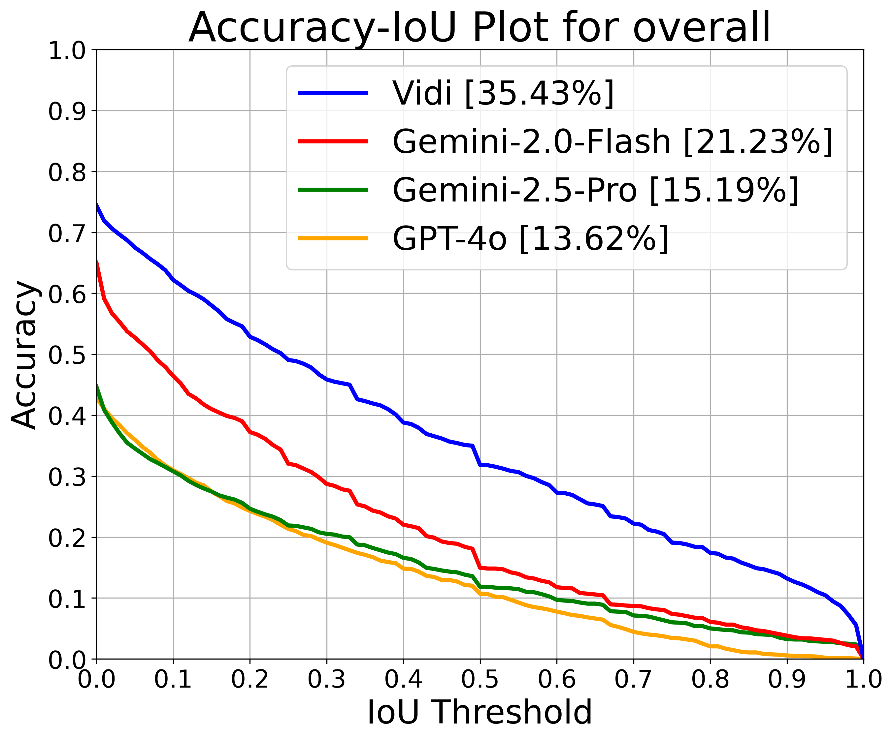

## Evaluation (VUE-TR)

We release the ground-truth annotation and evaluation results in 5 json files. Run the script for a standalone evaluation:

```
cd VUE_TR
bash install.sh
python3 -u qa_eval.py --pred_path results_Vidi.json
```
The result figures will be saved in the output folder ('./results' by default)
. See example figures below:

  

For evaluation of new models, first download the videos based on the ids in [video_id.txt](video_id.txt) from Youtube (e.g., [yt-dlp
](https://github.com/yt-dlp/yt-dlp)). Then run inference and save the results in the following format:
```
[
    {
        "query_id": 0,
        "video_id": "coPfnSFOXj0",
        "duration": 32.625,
        "query": "transition from storyboards to animation",
        "answer": [
            [
                0.0,
                32.29875
            ]
        ],
        "task": "temporal_retrieval"
    },
    ...
]
``` 